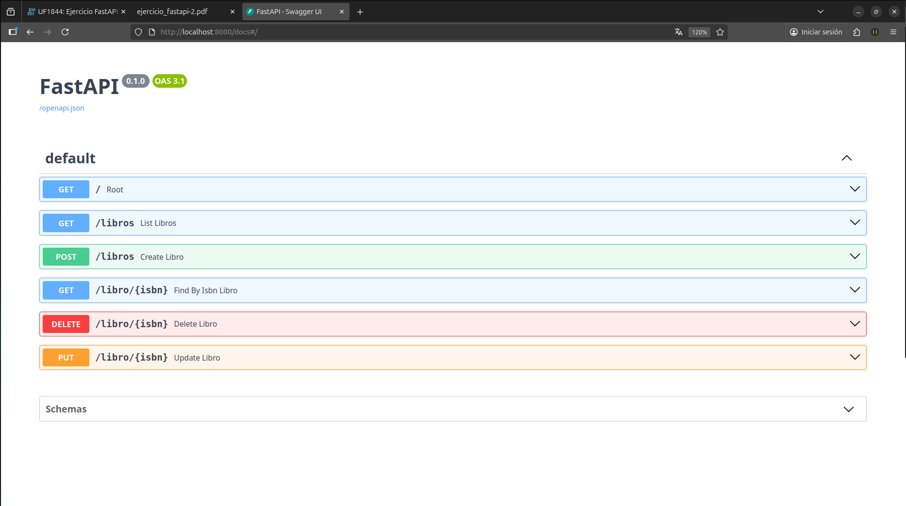
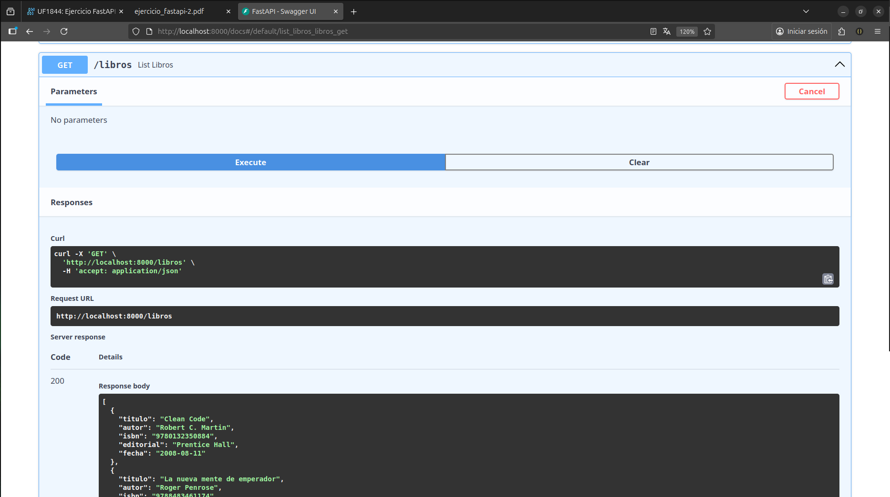
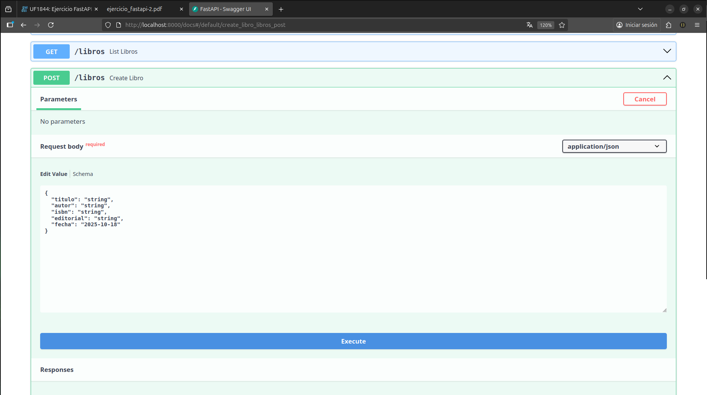
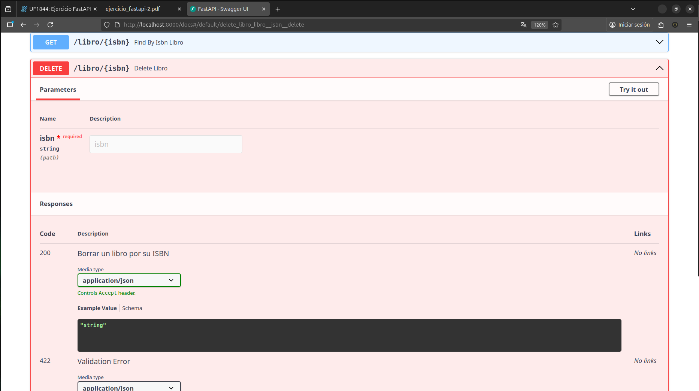
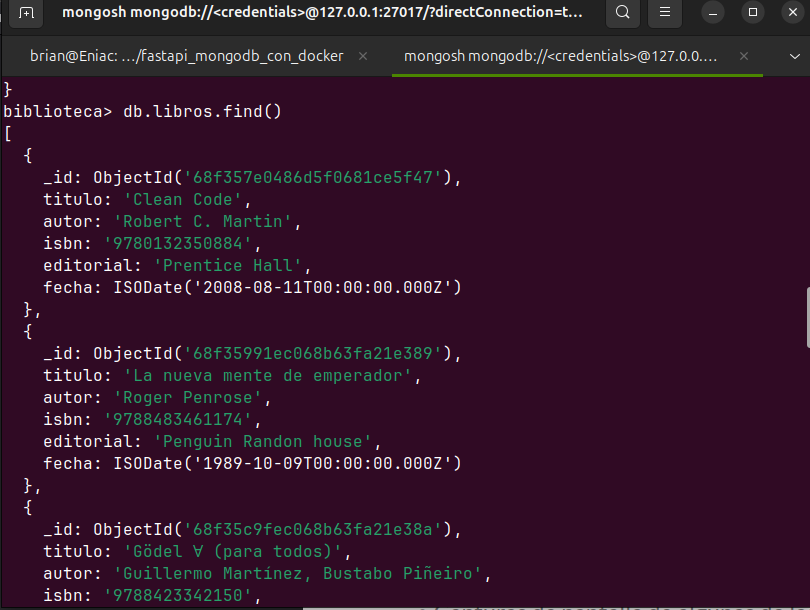
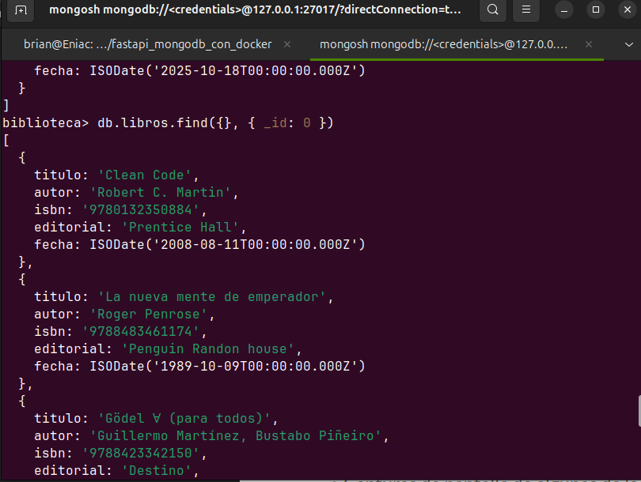
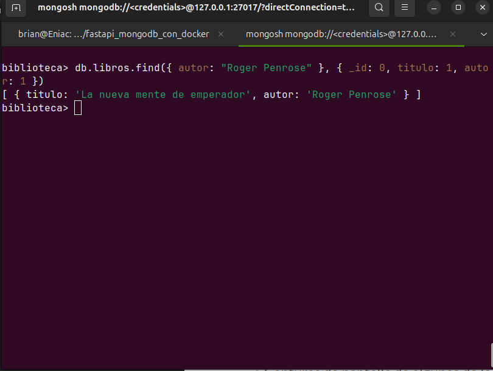

# Api-con-FastAPI-y-MongoDB-con-Docker

API CRUD de libros construida con FastAPI, Motor (MongoDB async) y Docker Compose. Incluye endpoints para listar, crear, obtener, actualizar y borrar libros. La fecha se envía como YYYY-MM-DD y se guarda en Mongo como datetime.


## Arquitectura

Servicio mongodb (imagen oficial mongo:7.0).

Servicio api que levanta uvicorn sobre FastAPI. El código se monta en ./api y el comando por defecto es uvicorn api.main:app --reload.


## Estructura del proyecto

```
.
├── api/
│   └── main.py
├── docker-compose.yml
├── Dockerfile
├── requirements.txt
└──  .env (oculto)  
   
 ```
El docker-compose.yml mapea ./api dentro del contenedor y arranca uvicorn api.main:app. Si cambias la carpeta o el nombre del módulo, ajusta ese comando.

## Imágenes de la Api y consultas en MongoDB









## ¿Qué es FastAPI?

Framework web para construir APIs rápidas en Python, basado en ASGI. Se apoya en:

Starlette (routing, middlewares, websockets).

Pydantic (validación/serialización con type hints).

Uvicorn (servidor ASGI).

## Por qué gusta tanto

Rápido (async/await, muy buen rendimiento).

Validación automática a partir de anotaciones de tipos.

Documentación automática: OpenAPI + Swagger UI (/docs) y ReDoc (/redoc).

Dependency Injection sencilla (para DB, auth, etc.).

Soporte nativo para OAuth2, JWT, CORS, Background tasks, WebSockets.

Tipado fuerte → mejor DX, autocompletado y menos bugs.

## Conceptos clave

Path operations: funciones asociadas a rutas/métodos (@app.get, @app.post, …).

Modelos Pydantic: definen el schema de entrada/salida y validan datos.

response_model: controla lo que devuelves (filtra campos, documenta).

status_code: HTTP correcto en cada operación.

Dependencias (Depends) para reutilizar lógica (DB sessions, auth).

Async: usa async def para E/S (DBs async como Motor, HTTP, etc.).

Dale una ⭐ a este repo si te ha gustado.